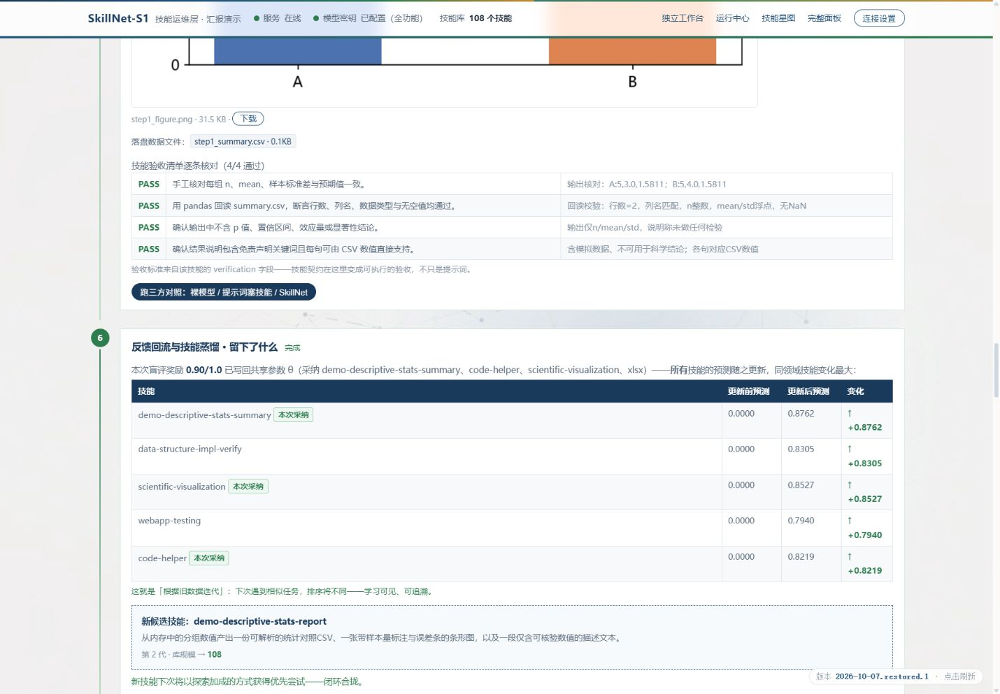
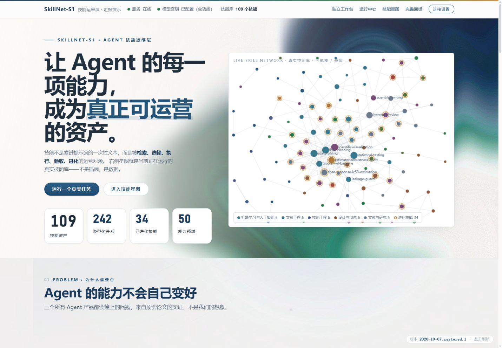
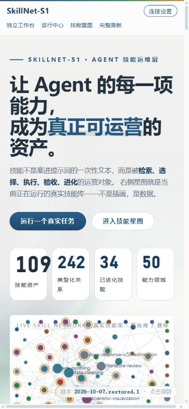

# 原设计与完整演示恢复验收

设计以 `c491d8c` 为基准，保留原项目的视觉、叙事结构与交互构思。功能修复采用局部补丁，后端可靠性与访问保护继续保留。

## 已恢复的内容

| 内容 | 当前行为 |
|---|---|
| 背景渲染 | bg-flow 首页流体背景、bg-grid 全站层次、bg-dark 深色星图 |
| 视觉细节 | 原蓝色、玻璃顶栏、卡片、节点光晕与呼吸、进场动画、指针微光、滚动进度 |
| 首页真实星图 | 拖拽、悬停、领域图例；随实时任务检索、编排、执行转为 DAG |
| 完整演示 | 保留本页七阶段，含三档检索、LinUCB 排序、编排、方案盲评、代码执行、反馈变化和产物 |
| 执行证据 | 展开完整代码、修复轨迹、逐条验收、真实图像、产物预览与下载 |
| 三方对照 | 裸模型 / 提示词技能 / 契约模式；重复演示的对照绑定各自的任务卡 |
| 连续对话 | 原双栏工作台、历史、追问上下文、完整执行详情与任务总结 |
| 能力证据 | 原论文对照、11 个展开入口、实时计算值与自核命令 |
| 手机 | 修正顶栏拥挤与背景文字对比度；宽表格在局部横向滚动，保留内容；DAG 随窗口尺寸重排 |

同源 Token、事件游标续传与去重、取消及异常状态、输入法、多轮会话防污染、运行搜索和手机 tabs 均继续保留。

## 真实演示

2026-10-07 在本地浏览器实际点击「七阶段完整演示（本页）」。公开数据 A=[1,2,3,4,5]、B=[2,3,4,5,6]；七个阶段全部显示完成，真实 PNG 成功加载，CSV 预览正常，4/4 条技能验收通过，反馈表显示更新前后差值，新技能通过准入。动画完成用时约 45.2 秒，最终费用读数 ¥0.0904、24,732 tokens。此同步演示先由服务计算，再按七阶段展开结果。

[完整七阶段截图](evidence/screenshots/restored-demo-seven-full.jpg) 保留所有阶段与实际产物。该次运行发现了模型把文字说明命名为 PNG 的旧缺陷，现已修复：文字生成器只输出对应文本格式，真实二进制文件由沙箱单独收集。修复由离线边界测试验证，不把旧文件伪称为图像。

另外实际点击「发送」验证实时链路：Run `690f6144-20261007-232529-0368` 完成 3 步，44.501 秒、¥0.1143，其中一步自动修复后成功；17/19 条程序化验收通过，未通过项仍保留。2 个实际 CSV/PNG 文件下载后均通过大小与 SHA-256 核验，CSV 均值分别为 3 和 4，样本标准差均为 1.5811。[结构化证据](evidence/restored-real-run.json)。

只读能力证据的泛化示例已改用技能副本，访问页面不会修改真实学习统计。本轮产生的公开演示技能保留，误计入的示例更新已恢复。

## 验证

- Python：176 项离线测试通过；31 项交付自检通过。
- 前端：15 个脚本语法与资源检查通过；5 项原渲染自检通过；新增首页流程检查覆盖断流续传、鉴权失败、计划/DAG 事件顺序、星图事件、评分有效性、产物路径、窗口重排和七阶段入口，已加入 CI。
- 浏览器：首页与其余主视图自检通过，1440/390 宽度检查；首页连接弹窗、能力证据、真实执行、产物预览均实际操作。
- HTTP 全面审查：P0/P1/P2 均为 0。

S1 客户端与契约测试继续保留，线上联调状态见 [S1 接入说明](s1-integration.md)。

[本轮机器可读验收记录](evidence/restoration-validation.json)。
