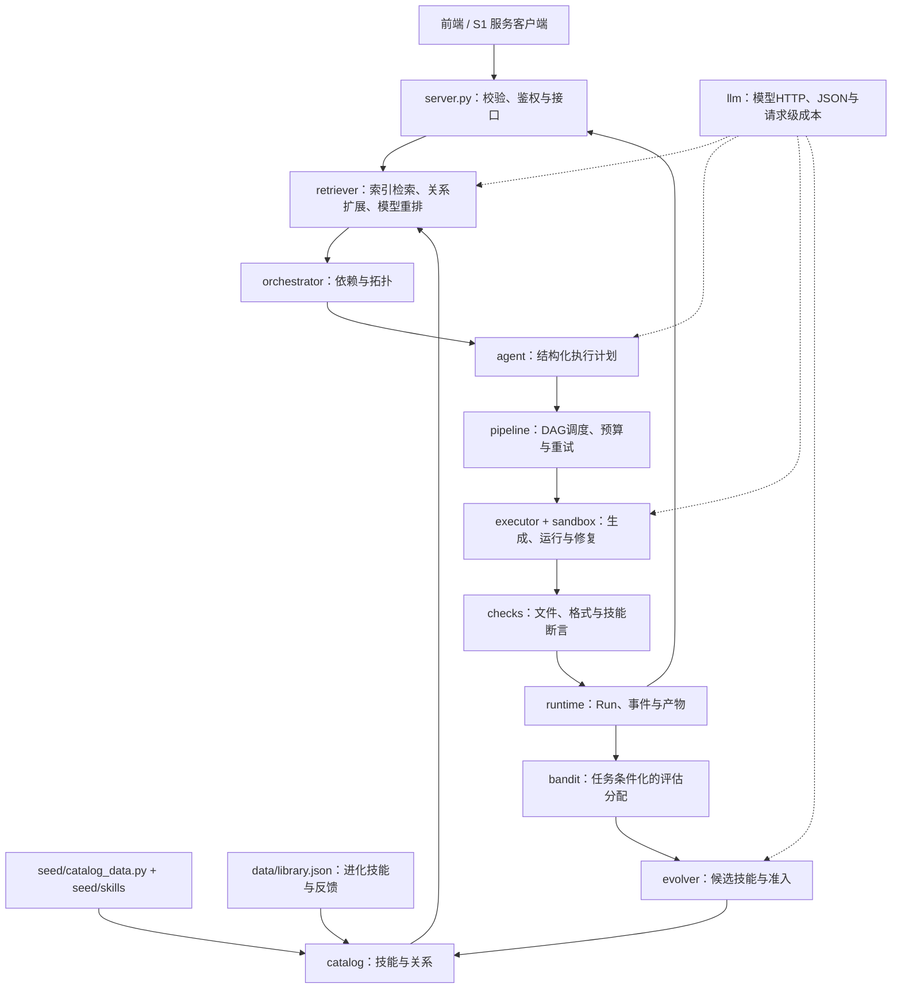

# SkillNet 项目地图与审查入口

本地图依据当前源码、离线测试和本地 HTTP 请求整理。组织方式借鉴 [AOCI-CODE](https://github.com/aoci-spec/aoci-code) 的职责、关系、契约、约束四个维度，便于后续维护者接手。它是人工审查文档，不替代 AOCI 的正式 Whole-Index，也不声称通过其 `aligned` 校验。

审查使用的 AOCI-CODE 官方源码位于仓库外的 `AOCI-code-reference`，拉取 commit 为 `df1fcb58e7df6a9c5030eb29829134ca07c3d001`。工具定位是维护项目认知的 Go CLI/MCP，而不是 SkillNet 的业务后端或 S1 SDK。它的源码和二进制不进入本项目仓库。

已下载官方 Windows amd64 `v0.1.0-rc18` 发布包，完成官方 `SHA256SUMS` 的基础校验，归档 SHA-256 为 `012072baeead1d37062e431f3191d3338e2e67789baec79549a8e0fd12c4a09b`。实际运行的二进制报告 commit `ffbdafac512d339aa87342d5b9d1a4f27a299aaf`。本次没有宣称完成发布者签名或完整供应链校验。

已在本仓库执行 `init` 和 `scan`，未配置宿主 MCP 或修改全局 Codex 设置。项目 Managed Scope 明确排除 `out/`、`data/`、`seed/skills/`、`report/`、`.e_*/**` 和 `_refs/`；保留后端源码、前端、关键工具、测试与文档。初始化扫描建立 100 个文件指纹，Guide 报告 78 个待创作目标，状态为 `authoring_required / complete=false`。`aoci*.txt` 当前是官方初始化骨架；后续完整语义索引应在业务文件稳定后通过实时 Guide 指导的维护流程完成。

## 实际数据链路

业务执行状态由 `runtime.Run` 管理。`ResearchAgent` 返回的方案、`judge` 的方案评分与 `pipeline` 的真实运行是不同层次的证据；展示结果时应沿用这一区别。

## 后端核心地图

| 文件 | 职责与主要契约 | 关键关系 | 必须保持的约束 |
|---|---|---|---|
| `server.py` | FastAPI HTTP、页面、静态文件；创建、查询、取消 Run 与 SSE | catalog / retriever / runtime / pipeline | 付费与写入入口需鉴权；请求模型不能让无效输入进入执行线程；各请求成本隔离 |
| `run.py` | 配置监听地址、端口、浏览器并启动 Uvicorn | config / server | 非本机监听必须配置服务令牌；默认本机演示 |
| `skillnet/config.py` | `.env`、模型、目录和计费常量 | 全部后端模块 | 密钥不入库；路径锚定项目；价格是配置假设而非外部账单 |
| `skillnet/schema.py` | Skill、能力契约、五维质量、SKILL.md 渲染 | catalog / evolver / adapters | 名称为 kebab-case；质量分是启发式先验，不能冒充实测效果 |
| `skillnet/catalog.py` | 种子加载、关系规范化、技能增删与原子持久化 | schema / seed / config | 读写受锁保护；基础种子由源码提供；升级不能抹掉演化结果 |
| `skillnet/index.py` | BM25、稀疏向量、融合及词元工具 | retriever / bandit / evolver | 使用稳定 CRC32；当前向量是稀疏文本表示，不能称作训练好的稠密编码器 |
| `skillnet/retriever.py` | 三档检索、关系扩展、重排与 Wiki 路由 | index / catalog / llm / orchestrator | 模型结果须结构校验；候选和边只引用真实技能；降级显式记录；置信度不是概率 |
| `skillnet/orchestrator.py` | 关系与模型边合并，生成拓扑顺序 | catalog / llm | 先后顺序必须满足保留依赖；坏边和环可观察；模型边不能替代已有前置依赖 |
| `skillnet/agent.py` | 技能卡/正文参与结构化研究计划；记录技能采纳 | catalog / llm | 提供方案不等于完成实验；执行样式应与对照组一致 |
| `skillnet/pipeline.py` | 计划转步骤、依赖调度、产物传播、重试、验收与终态 | runtime / executor / sandbox / checks | 上游失败阻断依赖步骤；每次运行历史独立；预算和取消必须在检查点生效 |
| `skillnet/executor.py` | 单步代码生成、失败修复、技能语义验收 | llm / sandbox | 技能步骤、陷阱和验收进入执行约束；修复带真实 stderr；不能伪造已运行输出 |
| `skillnet/sandbox.py` | 以受限环境变量运行 Python 子进程，收集目录内产物 | executor / pipeline | 不继承模型密钥；限制超时与输出；主机子进程不是对抗性代码的安全隔离 |
| `skillnet/checks.py` | 文件、CSV、JSON、PNG、Python 语法、数值与技能断言 | pipeline / executor | 确定性可验证事实先由程序验证；未知断言不能悄悄判为成功 |
| `skillnet/runtime.py` | Run / Step / Attempt / Artifact / Event / Budget、持久化及事件总线 | pipeline / server | 终态不可被意外覆盖；run_id 独立；重启清扫未终止任务；当前内存调度为单进程 |
| `skillnet/llm.py` | 模型请求、结构化输出、token 与请求级成本账本 | config / 全部模型调用点 | 并发记账隔离；子步骤用量纳入运行总账；模型错误不得泄漏凭据 |
| `skillnet/judge.py` | 独立方案评审、rubric 与专业要点覆盖 | llm / agent / bench | 盲评不使用组名；模型评分与确定性验收分开；科研有效性不能仅靠一份评分证明 |
| `skillnet/bandit.py` | Shared LinUCB、task-skill 特征与评估预算分配 | index / schema / catalog | 共享参数才有跨技能泛化；奖励不能作为输入泄漏标签；最终效果依据真实观察 |
| `skillnet/evolver.py` | 蒸馏、变异、交叉、再生成和准入去重 | llm / schema / catalog | 安全性与质量检查先于入库；名称与关系必须合法；演化候选不能自动等于生产技能 |
| `skillnet/artifacts.py` | 方案报告、Markdown、代码块的确定性渲染 | agent / server | 展示产物性质；HTML 转义；稳定字节便于复核，不能把方案当实验结果 |
| `skillnet/adapters.py` | 多客户端技能目录、ADK、工具声明和压缩索引导出 | catalog / schema | 技能目录名称校验；跨框架声明须配真实处理器；导出不会自动建立 S1 线上连接 |
| `skillnet/integration.py` | 连接池 HTTP 客户端、发现工具、Run/SSE 与产物校验 | server 的实际 API | 默认检索不调用模型；拒绝跨域重定向；不自动重试有副作用请求；S1 用户权限由宿主校验 |

## 前端与证据地图

| 位置 | 可见功能 | 事实来源与维护入口 |
|---|---|---|
| `web/briefing.html` + `assets/briefing.*` | 面向管理层的价值、能力、证据和接入说明 | 实时接口与历史原始实验区分；不可把冻结库评估当作当前库效果 |
| `web/app.html` | 运行中心、技能资产与实验视图 | `/api/runs`、`/api/skills`、`/api/results` |
| `web/chat.html` | 对话、技能执行、追问和取消 | `/api/runs` 与实际运行事件；恢复应依据持久化 Run 状态 |
| `web/run.html` | 单次运行回放、阶段耗时、验收、代码与产物 | `/api/runs/{id}`、事件与产物接口 |
| `web/graph.html` | 领域关系图、技能详情、邻居筛选 | `/api/graph` 和 `/api/skills`；技能节点名为稳定标识 |
| `web/index.html` | 详细检索、编排、对照与导出控制台 | 实际组件接口；与管理层首页职责不同 |
| `web/assets/ui.js` + `ui.css` | 跨页面交互、服务令牌、请求、事件流与设计规范 | 服务令牌只用于同源 API；SSE 与 HTTP 失败需明确显示 |
| `web/assets/product.js` + `product.css` | 六页公共导航、运行证据、真实 DAG、文件预览与实验展示 | 状态来自实际 Run；程序/语义/学习分别展示；CSV 与文本安全转义；按原始实验文件键取数 |
| `seed/skills` + `seed/catalog_data.py` | 基础技能正文和结构化契约 | 能力、步骤、陷阱、验收、标签与关系的源码证据 |
| `tasks/` + `bench/` + `out/exp*.json` | 冻结任务、对照组与实验原始记录 | 数据集/库版本/模型/预算需一起比较；历史结果不代表所有任务显著改进 |
| `tests/` + `verify.py` | Runtime、预算、验收、依赖、分流与集成回归 | 默认离线测试；真实模型实验单独授权和记账 |
| `docs/s1-integration.md` | 可执行接入示例和公司环境验收范围 | 实际 HTTP 契约；线上 S1 认证、租户与执行隔离尚需接入验收 |

## 本轮审查确定的行为修复

模型 JSON 即使语法正确也可能给出数组、对象、坏边、重复技能或不存在的节点。现在路由与编排先验证结构，无法使用的结果回退到实际检索和已知关系，并显示降级原因。模型提出的反向边会被拒绝，避免为了容纳它而删除原有依赖。路由返回的拓扑顺序与最终工作流来自同一个验证结果。

BM25 对照候选只标注实际执行的 BM25 渠道，未经过模型重排的尾部候选保持 `rerank_score=null`。这些变化避免把未执行的组件或负数重排得分误呈现为真实证据。

集成层提供实际可调用的 `search_skills` / `load_skill`，补上只有工具 schema 而没有处理器的缺口。客户端已在本地服务验证健康、真实检索和完整技能正文；线上 S1 状态仍明确标注未验证。

## 接手时的验证顺序

先运行 `python -m pytest tests -q` 和 `python verify.py`，确认确定性行为，再启动服务核对 `/api/health`、混合检索和技能正文。演示入口、技能数量和历史实验结果都应来自当前接口。只有需要评估模型或执行真实科研代码时才运行付费链路。

引入真正的多租户部署前，应补齐外部身份授权、独立执行 worker、共享运行存储与分布式事件队列。当前原型的服务令牌、磁盘运行记录和内存事件总线为单实例内部部署提供基础，不代表这些生产能力已经存在。

0.9 全页面与组件覆盖、后端输入版本与历史目录修复、实验结果键结构修复和双通道失败诊断，见 [全产品优化与验收](full-product-upgrade.md)。AOCI 初始化索引仍是待创作骨架，未据此声明语义索引完整。
