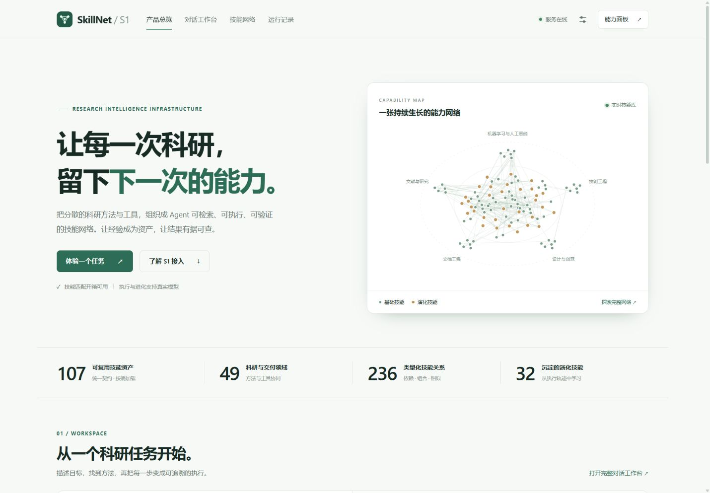
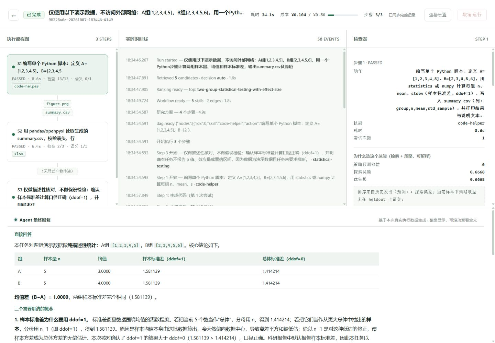

# SkillNet / S1 0.8 交付说明

本轮将现有原型整理为可以面向管理层演示、可以从 S1 后端调用的科研技能服务。审查覆盖前端六个主视图、HTTP 契约、检索与编排、执行预算、并发持久化、模型输出、运行回放及产物下载。

## 产品与设计

首页重新组织为价值说明、实时能力网络、任务入口、结果证据与 S1 接入。技能数量和关系取自实际接口；冻结实验标明数据集与指标，避免把历史结果解释为当前线上收益。

操作页统一石墨绿、暖白、清晰字体层次与可操作的状态反馈。运行中心提供搜索和状态筛选，手机上以卡片显示任务、耗时、费用、步骤和产物；对话支持多轮恢复、取消与输入法；回放支持流程、时间线、代码和产物，事件重连使用序号去重。图谱支持技能搜索、详情与键盘操作。

连接设置使用当前标签页会话令牌，只向同源 API 发送；保存前通过专门的只读接口验证。静态资产加入版本号，解决页面更新但共享脚本仍被缓存的问题。

## 行为与可靠性修复

- **并发与成本**：在父线程复制请求上下文，DAG 子步骤共享线程安全账本，统计包括收尾报告；运行取消和调用数限制覆盖整个链路。
- **状态与存储**：运行和技能库使用唯一临时文件、同步落盘与锁；列表优先返回当前内存状态；启动清扫中断运行，保留可查询的历史。
- **编排**：检索、Wiki、实际执行统一使用验证后的技能依赖和拓扑顺序。坏边、未知技能、重复项和模型产生的环可观察；基础依赖不可被模型边覆盖。
- **反馈学习**：共享 LinUCB 更新与重绑定受锁保护；刷新技能索引保留已累积参数。
- **接口**：后台任务有并发上限和 429 重试提示，模型检索和写入接口受令牌保护，请求 ID 贯穿响应，模型错误脱敏。
- **回放与产物**：SSE 持久化事件支持游标重连；文件按实际二进制返回，路径和符号链接防止逃逸；生成 HTML/SVG 使用受限呈现策略。
- **S1 客户端**：连接池、结构校验、检索/正文工具处理器、Run、取消、事件订阅、SHA-256 和大小校验均有实现。不会自动重试有副作用的请求。
- **干净安装**：补齐默认表格、绘图与电子表格执行所需依赖；一键启动检查这些依赖，模型的可用库清单包含 openpyxl。

## 真实执行证据

本次使用真实 DeepSeek 服务执行公开演示数据：A=[1,2,3,4,5]，B=[2,3,4,5,6]。运行号为 **95228a6c-20261007-183446-4149**，状态 COMPLETED，3 个执行步骤，34.111 秒，12 次模型调用，32,061 tokens，服务估算费用 **¥0.1041**。

独立下载并复算 [summary.csv](evidence/summary.csv)：两组 n=5，均值分别为 3 和 4，样本标准差均为 1.5811388300841898。4 个 CSV/PNG 产物的大小与 SHA-256 核验一致。[结构化证据](evidence/real-run.json) 保留预算、模型、检查摘要、演化结果和产物哈希。

该任务用于验证计算和文件链路，不构成科学推断。执行完成也不表示每项语义验收都通过；回放保留各项结果。此次运行发生在最终报告提示词和编排一致性修复之前，最后修复由离线回归验证，未再调用付费模型。

## 验收

本机环境为 Windows、Python 3.12、Node 24。验证命令与最终结果见 [验收记录](evidence/validation.json)。覆盖离线回归、组件检查、前端语法/资源、实际 HTTP 自检和全面审查。浏览器在 1440 和 390 宽度验证主页面、连接弹窗、预检与真实运行回放；没有发现页面横向溢出或 JavaScript 异常。

CI 为 Windows/Linux × Python 3.11/3.12 四个组合，禁用模型密钥，只做离线验证。本机没有 Docker，Dockerfile 已提供但未验证镜像构建。

跨平台 CI 还修复了原有关键路径测试对宿主启动时间的假设：现在核对真实依赖路径及其步骤耗时总和，避免较快的 Linux 执行环境被误判为失败。

## 建议的三分钟汇报

1. 在首页说明：将方法和工具变成可检索、可验收的技能资产，实时网络展示当前规模。
2. 点“数据分析”进行能力预检，打开技能卡，展示输入、输出、步骤、陷阱与验收契约；此操作没有模型费用。
3. 打开本次真实运行，展示正确 CSV、可复核代码、事件、预算和最终回答；不需要重复付费执行。
4. 展示 S1 接入：先将 search_skills / load_skill 交给现有 Agent，再接运行与证据。线上认证、租户权限和隔离执行的验收由公司环境完成。

## 接入与维护状态

**S1：服务契约和客户端就绪，线上联调未验证。** 本轮未修改 S1 线上项目或建立生产连接。具体接口与验收边界见 [S1 接入文档](s1-integration.md)。当前服务是单进程内部原型；企业部署仍需独立代码执行隔离、宿主用户授权、共享任务队列和存储。

**AOCI-CODE：已拉取官方项目并完成初始化扫描，语义索引待创作。** 当前 aoci*.txt 为官方骨架，不能声称完整 Whole-Index 或 aligned。仓库保留 scope 配置与 [项目地图](project-map.md)，不提交本机基线、ledger、Receipt 或未启用的代理维护合同；没有修改全局 Codex 设置。
