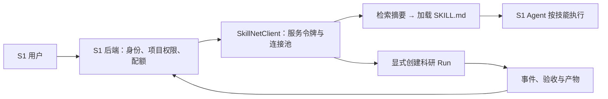

# 立理 S1 接入契约

SkillNet 已提供可运行的服务客户端、技能工具处理器及离线契约测试。目标接入方式是 **S1 后端调用 SkillNet 服务**，让 S1 的 Agent 按需检索和读取技能，也可以显式发起有预算的科研运行。

这份交付验证的是本仓库 HTTP 契约。当前未获取 S1 的后端代码、SSO 协议或服务凭据，未验证与 `https://s1.liliai.cn/` 的线上连接；因此集成清单明确返回 `production_connection_verified: false`。本地 Nexus 参考项目使用 FastAPI + Streamlit，并通过 `X-Zhipu-Key` 接收每次请求的模型密钥，这只能作为参考实现，不能视作 S1 的线上接口。

## 服务边界



第一阶段建议只接入 `search_skills` 和 `load_skill` 两个发现工具。S1 保持现有模型、工具和执行流程，SkillNet 提供一层可检索的技能能力。`hybrid` 检索不调用模型；只有 S1 请求某个技能时才读取完整正文。

第二阶段再接入 Run Runtime。S1 保存 `user_id / project_id / conversation_id → run_id` 的权限映射，展示执行事件及验收证据。查询、取消和下载都先检查这个映射，然后转发到 SkillNet。当前 SkillNet 的服务令牌不能提供用户或租户隔离。

## 可运行的技能工具

客户端位于 `skillnet/integration.py`，使用现有 `httpx` 与 `pydantic` 依赖。将它作为本项目模块导入，或让 S1 的适配层依赖这一模块；不要把服务令牌放进浏览器前端。

```python
import json
import os

from skillnet.integration import ClientConfig, SkillNetClient, skill_tools

config = ClientConfig(
    base_url=os.environ.get("SKILLNET_BASE_URL", "http://127.0.0.1:8848"),
    token=os.environ.get("SKILLNET_TOKEN", ""),
)

with SkillNetClient(config) as client:
    health = client.health()
    declarations = skill_tools()
    # 注册 declarations 到 S1 Agent 的函数工具集合。
    # Agent 发出调用后，使用对应名称与参数进入真正的 HTTP 处理器：
    discovery = client.call_tool("search_skills", {"query": "单细胞测序质控与聚类", "k": 3})
    if discovery["selected"]:
        skill = client.call_tool("load_skill", {"name": discovery["selected"][0]})
        tool_result = json.dumps(skill, ensure_ascii=False)
        # 将 tool_result 返回给发起调用的 S1 Agent；按正文步骤和验收条件执行。
```

在常驻后端中共享一个 `SkillNetClient`，并在应用关闭时调用 `close()`。它复用 HTTP 连接池，可在服务路径前带反向代理前缀，如 `https://internal.example/skillnet`。远程默认使用 HTTPS；受控内网确需 HTTP 时显式设置 `allow_insecure_http=True`。

工具处理器只接受白名单参数，拒绝路径穿越、错误参数类型和额外执行指令。搜索工具固定使用 `hybrid`，Agent 无法通过工具参数偷偷切换到付费重排。返回的是选中技能的摘要，随后 `load_skill` 返回真实 `SKILL.md` 内容。

`confidence` 是词汇匹配的启发式相关度，字段 `confidence_kind` 明确标识为 `heuristic_relevance_not_probability`。它不是正确率或安全执行概率。S1 不应单凭 `decision="auto"` 授予执行工具或访问业务数据的权限。

## HTTP 契约

| 操作 | 实际接口 | 客户端方法 | 说明 |
|---|---|---|---|
| 服务健康 | `GET /api/health` | `health()` | 可检测模型是否已配置、是否需要令牌 |
| 技能检索 | `POST /api/search` | `search(query, k=5, mode="hybrid")` | 发送单档 `modes`；Fabric 会调用模型，需显式选择 |
| 技能正文 | `GET /api/skill/{name}` | `load_skill(name)` | 返回 `skill` 与 `markdown` |
| 创建执行 | `POST /api/runs` | `create_run(task, **budgets)` | 后台执行，立即返回独立 `run_id` |
| 查询执行 | `GET /api/runs/{run_id}` | `get_run(run_id)` | 含步骤、预算、成本、验收与产物元数据 |
| 实时事件 | `GET /api/runs/{run_id}/stream` | `iter_run_events(run_id)` | SSE，支持 heartbeat、事件 ID 与 `end` |
| 请求取消 | `POST /api/runs/{run_id}/cancel` | `cancel_run(run_id)` | 在执行检查点停止 |
| 下载产物 | `GET /api/runs/{run_id}/artifacts/{name}` | `download_artifact(...)` | 有大小上限，可对照 manifest 的 SHA-256 |

契约清单由 `integration_manifest()` 返回，区分已支持的服务能力与尚未验证的线上连接。完整服务请求模型可通过 `/openapi.json` 检查。

## 有预算的运行

创建 Run 会调用服务端配置的模型，必须由 S1 的用户操作或明确授权的 Agent 流程触发。

```python
from skillnet.integration import ClientConfig, IntegrationError, SkillNetClient

with SkillNetClient(config) as client:
    created = client.create_run(
        "比较两组单细胞样本的表达差异，并产出可复核报告",
        k=5, max_steps=3,
        max_cost_yuan=0.5, max_seconds=180, max_llm_calls=20,
    )
    run_id = created["run_id"]
    # 立即将 run_id 与当前 S1 用户和项目绑定。
    try:
        for event in client.iter_run_events(run_id):
            # 将 event 转发到 S1 的事件流；据 id 做幂等展示。
            if event["event"] == "end":
                break
    except IntegrationError:
        # 断流只代表传输结束；从运行实体获取真实状态。
        pass
    current = client.get_run(run_id)
    for artifact in current.get("artifacts", []):
        content = client.download_artifact(
            run_id, artifact["name"], expected_sha256=artifact.get("sha256") or None,
        )
        # 存入 S1 项目产物系统，沿用项目权限和附件审核流程。
```

客户端不会自动重试创建和取消请求。创建请求超时意味着服务端可能已经接受任务；调用方应查询或对账，避免再次创建并重复扣费。SSE 客户端能发送 `last_event_id`，实际回放行为以部署版本的事件接口为准；S1 的展示端应按事件 ID 去重。

错误通过 `IntegrationError.code` 分类为 `unauthorized`、`forbidden`、`not_found`、`invalid_request`、`rate_limited`、`unavailable`、`timeout`、`transport_error`、`invalid_response`、`response_too_large` 或 `digest_mismatch`，并保留 HTTP 状态与 `X-Request-ID`。错误不会回显上游响应正文、模型密钥或任务内容。连接不会携带服务令牌跟随重定向。

## 部署与验收

当前运行状态及事件总线属于单进程服务，应以单个 Uvicorn worker 部署。多进程扩容需要共享任务队列、数据库状态和跨进程事件投递；复制 worker 不能直接提供这些能力。

当前代码执行使用主机子进程，目录、超时及输出限制不等同于容器或操作系统安全隔离。接入公司业务环境前，将执行 worker 放入独立容器/低权限账号，限制网络、文件系统和资源；S1 的登录会话与业务数据库凭据不应传入模型生成的执行程序。

接入验收应确认以下事实：

1. S1 的后端环境能访问 SkillNet `/api/health`，服务令牌只存放在后端。
2. 检索工具返回真实技能，加载正文后 S1 Agent 会使用技能步骤与验收条件。
3. 使用小预算任务跑通创建、事件、取消和产物下载，超限状态在 S1 可见。
4. 不同用户不能查询、取消或下载他人的 `run_id`；此项在 S1 权限层验证。
5. 主机执行隔离、密钥边界、持久化备份和故障恢复通过公司环境验收。

离线验证命令：

```bash
python -m pytest tests/test_integration.py tests/test_orchestration_contract.py -q
```

测试使用 `httpx.MockTransport` 验证真实 HTTP 请求格式、工具分发、服务令牌、异常分类、超时不重试、SSE、摘要与正文分离、产物 SHA-256 和大小限制；不会访问 S1 或消耗模型额度。
