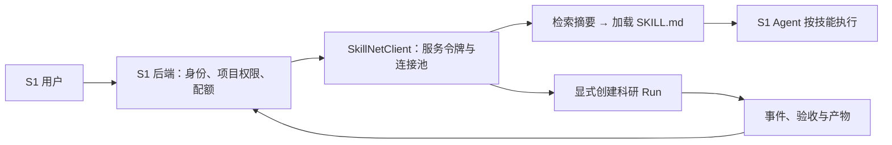

# 立理 S1 接入契约

SkillNet 已提供可运行的服务客户端、技能工具处理器及离线契约测试。目标接入方式是 **S1 后端调用 SkillNet 服务**，让 S1 的 Agent 按需检索和读取技能，也可以显式发起有预算的科研运行。

这份交付验证的是本仓库 HTTP 契约。当前未获取 S1 的后端代码、SSO 协议或服务凭据，未验证与 `https://s1.liliai.cn/` 的线上连接；因此集成清单明确返回 `production_connection_verified: false`。本地 Nexus 参考项目使用 FastAPI + Streamlit，并通过 `X-Zhipu-Key` 接收每次请求的模型密钥，这只能作为参考实现，不能视作 S1 的线上接口。

## 服务边界



第一阶段建议只接入 `search_skills` 和 `load_skill` 两个发现工具。S1 保持现有模型、工具和执行流程，SkillNet 提供一层可检索的技能能力。`hybrid` 检索不调用模型；只有 S1 请求某个技能时才读取完整正文。

第二阶段再接入 Run Runtime。S1 保存 `user_id / project_id / conversation_id → run_id` 的权限映射，展示执行事件及验收证据。查询、取消和下载都先检查这个映射，然后转发到 SkillNet。服务令牌用于服务级访问；启用下面的签名身份后，SkillNet 会对 Run、产物、列表、跨轮文件和候选进行同一租户/用户/项目检查。S1 仍应在自己的业务权限层验证当前用户可访问的项目。

## 可运行的技能工具

客户端位于 `skillnet/integration.py`，使用现有 `httpx` 与 `pydantic` 依赖。将它作为本项目模块导入，或让 S1 的适配层依赖这一模块；不要把服务令牌放进浏览器前端。

```python
import json
import os

from skillnet.integration import ClientConfig, SkillNetClient, skill_tools

config = ClientConfig(
    base_url=os.environ.get("SKILLNET_BASE_URL", "http://127.0.0.1:8848"),
    token=os.environ.get("SKILLNET_TOKEN", ""),
)

with SkillNetClient(config) as client:
    health = client.health()
    declarations = skill_tools()
    # 注册 declarations 到 S1 Agent 的函数工具集合。
    # Agent 发出调用后，使用对应名称与参数进入真正的 HTTP 处理器：
    discovery = client.call_tool("search_skills", {"query": "单细胞测序质控与聚类", "k": 3})
    if discovery["selected"]:
        skill = client.call_tool("load_skill", {"name": discovery["selected"][0]})
        tool_result = json.dumps(skill, ensure_ascii=False)
        # 将 tool_result 返回给发起调用的 S1 Agent；按正文步骤和验收条件执行。
```

在常驻后端中共享一个 `SkillNetClient`，并在应用关闭时调用 `close()`。它复用 HTTP 连接池，可在服务路径前带反向代理前缀，如 `https://internal.example/skillnet`。远程默认使用 HTTPS；受控内网确需 HTTP 时显式设置 `allow_insecure_http=True`。

工具处理器只接受白名单参数，拒绝路径穿越、错误参数类型和额外执行指令。搜索工具固定使用 `hybrid`，Agent 无法通过工具参数偷偷切换到付费重排。返回的是选中技能的摘要，随后 `load_skill` 返回真实 `SKILL.md` 内容。

`confidence` 是词汇匹配的启发式相关度，字段 `confidence_kind` 明确标识为 `heuristic_relevance_not_probability`。它不是正确率或安全执行概率。S1 不应单凭 `decision="auto"` 授予执行工具或访问业务数据的权限。

## HTTP 契约

| 操作 | 实际接口 | 客户端方法 | 说明 |
|---|---|---|---|
| 服务健康 | `GET /api/health` | `health()` | 可检测模型是否已配置、是否需要令牌 |
| 技能检索 | `POST /api/search` | `search(query, k=5, mode="hybrid")` | 发送单档 `modes`；Fabric 会调用模型，需显式选择 |
| 技能正文 | `GET /api/skill/{name}` | `load_skill(name)` | 返回 `skill` 与 `markdown` |
| 创建执行 | `POST /api/runs` | `create_run(task, **budgets)` | 后台执行，立即返回独立 `run_id` |
| 查询执行 | `GET /api/runs/{run_id}` | `get_run(run_id)` | 含步骤、预算、成本、验收与产物元数据 |
| 实时事件 | `GET /api/runs/{run_id}/stream` | `iter_run_events(run_id)` | SSE，支持 heartbeat、事件 ID 与 `end` |
| 请求取消 | `POST /api/runs/{run_id}/cancel` | `cancel_run(run_id)` | 在执行检查点停止 |
| 下载产物 | `GET /api/runs/{run_id}/artifacts/{name}` | `download_artifact(...)` | 有大小上限，可对照 manifest 的 SHA-256 |

契约清单由 `integration_manifest()` 返回，区分已支持的服务能力与尚未验证的线上连接。完整服务请求模型可通过 `/openapi.json` 检查。

## 有预算的运行

创建 Run 会调用服务端配置的模型，必须由 S1 的用户操作或明确授权的 Agent 流程触发。

```python
from skillnet.integration import ClientConfig, IntegrationError, SkillNetClient

with SkillNetClient(config) as client:
    created = client.create_run(
        "比较两组单细胞样本的表达差异，并产出可复核报告",
        k=5, max_steps=3,
        max_cost_yuan=0.5, max_seconds=180, max_llm_calls=20,
    )
    run_id = created["run_id"]
    # 立即将 run_id 与当前 S1 用户和项目绑定。
    try:
        for event in client.iter_run_events(run_id):
            # 将 event 转发到 S1 的事件流；据 id 做幂等展示。
            if event["event"] == "end":
                break
    except IntegrationError:
        # 断流只代表传输结束；从运行实体获取真实状态。
        pass
    current = client.get_run(run_id)
    for artifact in current.get("artifacts", []):
        content = client.download_artifact(
            run_id, artifact["name"], expected_sha256=artifact.get("sha256") or None,
        )
        # 存入 S1 项目产物系统，沿用项目权限和附件审核流程。
```

客户端不会自动重试创建和取消请求。创建请求超时意味着服务端可能已经接受任务；调用方应查询或对账，避免再次创建并重复扣费。SSE 客户端能发送 `last_event_id`，实际回放行为以部署版本的事件接口为准；S1 的展示端应按事件 ID 去重。

连续追问应携带真实产物引用，摘要只提供对话背景：

```python
# current 为同一签名身份已完成的上轮 Run。
source = next(a for a in current["artifacts"] if a["name"].endswith("monthly_summary.csv"))
followup = client.create_run(
    "读取 monthly_summary.csv，保留原值并按毛利率升序生成 risk.csv。",
    max_steps=1, max_cost_yuan=0.8,
    history=[{"q": current["task"], "a": "已生成月度汇总。", "run_id": current["run_id"]}],
    artifact_refs=[{"run_id": current["run_id"], "name": source["name"], "sha256": source["sha256"]}],
)
```

`history` 最多 20 项，`artifact_refs` 最多 16 项；后端检查来源身份、登记文件与 SHA-256，再将确切版本传给执行步骤。原值投影与排序契约由服务端独立比较输入和输出。真实 SDK 联调与独立文件核验见 [业务追问证据](../out/business-followup-evidence.json)。复核已发布记录无需模型调用：

```bash
python tools/business_followup_smoke.py --business-run b5492bb7-20261008-174014-44aa --followup-run 02f80093-20261008-175420-f527
```

省略已有 Run 参数会新建付费任务，两个预算分别为 ¥1.20 / ¥0.80。此工具验证 SkillNet 服务客户端，不等同于目标 S1 的 SSO 与业务权限联调。

错误通过 `IntegrationError.code` 分类为 `unauthorized`、`forbidden`、`not_found`、`invalid_request`、`rate_limited`、`unavailable`、`timeout`、`transport_error`、`invalid_response`、`response_too_large` 或 `digest_mismatch`，并保留 HTTP 状态与 `X-Request-ID`。错误不会回显上游响应正文、模型密钥或任务内容。连接不会携带服务令牌跟随重定向。

## 部署与验收

默认线程模式使用单个 API 进程。设置 `SKILLNET_WORKER_MODE=external` 时，API 只持久化入队，独立执行进程通过 SQLite 租约领取任务，SSE 读取持久化检查点。当前是单主机、一个技能库写入 worker；进程锁防止第二个写入 worker。API 与 worker 必须共享相同的 out/data 路径。跨主机扩容不在此实现范围内。

当前代码执行使用主机子进程，目录、超时及输出限制不等同于容器或操作系统安全隔离。接入公司业务环境前，将执行 worker 放入独立容器/低权限账号，限制网络、文件系统和资源；S1 的登录会话与业务数据库凭据不应传入模型生成的执行程序。

接入验收应确认以下事实：

1. S1 的后端环境能访问 SkillNet `/api/health`，服务令牌只存放在后端。
2. 检索工具返回真实技能，加载正文后 S1 Agent 会使用技能步骤与验收条件。
3. 使用小预算任务跑通创建、事件、取消和产物下载，超限状态在 S1 可见。
4. 不同用户不能查询、取消或下载他人的 `run_id`；此项在 S1 权限层验证。
5. 主机执行隔离、密钥边界、持久化备份和故障恢复通过公司环境验收。

离线验证命令：

```bash
python -m pytest tests/test_integration.py tests/test_orchestration_contract.py -q
```

测试使用 `httpx.MockTransport` 验证真实 HTTP 请求格式、工具分发、服务令牌、异常分类、超时不重试、SSE、摘要与正文分离、产物 SHA-256 和大小限制；不会访问 S1 或消耗模型额度。


## 签名身份与独立执行（本轮新增）

在 API 与 S1 后端的密钥配置中设置同一个 `SKILLNET_S1_SIGNING_KEY`（至少 32 字符）；不要传给浏览器。签名涵盖方法、路径、正文 SHA-256、时间戳、随机 nonce 和租户/用户/项目 ID，120 秒有效，变更请求的 nonce 被 SQLite 持久化去重。相同签名写请求再次提交返回 409；请求超时后应先对账，不能假定没有创建任务。

```python
import os
from skillnet.integration import ClientConfig, SkillNetClient
from skillnet.s1_identity import S1Context

# ID 由 S1 已认证的后端上下文提供，不接受浏览器自行指定。
identity = S1Context(tenant="company", user="stable-user-id", project="stable-project-id")
with SkillNetClient(ClientConfig(token=os.environ["SKILLNET_TOKEN"]),
                    identity=identity, signing_key=os.environ["SKILLNET_S1_SIGNING_KEY"]) as client:
    records = client.get_run("known-run-id")
```

PowerShell 部署示例（两个终端使用同一配置）：

```powershell
$env:SKILLNET_WORKER_MODE='external'
$env:SKILLNET_SANDBOX='docker'
$env:SKILLNET_SANDBOX_IMAGE='skillnet-executor:local'
# 在密钥存储中另配 SKILLNET_TOKEN、SKILLNET_S1_SIGNING_KEY、DEEPSEEK_API_KEY
docker build -f deploy/Dockerfile.executor -t skillnet-executor:local .
# 终端 1
python -m uvicorn server:app --host 127.0.0.1 --port 8848
# 终端 2
python -m skillnet.worker
```

可用 `SKILLNET_OUT_DIR` 和 `SKILLNET_DATA_DIR` 配置共享的本机目录。宿主进程模式是 `SKILLNET_SANDBOX=process`；Docker 模式不可用时不会回退。已发出的模型请求仍在其调用预算内结束；worker 租约丢失只标记中断并保留检查点，不静默重复收费。

Linux API / worker 使用拥有上述目录的非 root 账号。执行容器沿用该 UID / GID，避免 bind mount 无法写入；root worker 会明确报错，不将目录改为全员可写。Docker 限制已在 Linux CI 中实际验证，包含连续文件传递和超时终止，见 [容器实测](../out/docker-smoke.json)；Windows Docker 与公司环境仍需分别验证。

本机真实测试覆盖排队后 API 重启、执行期间 API 重启、取消、不同签名身份的 Run/产物隔离以及终态 SSE 回放，见 `out/deployment-smoke.json`。这不替代目标 S1 的 SSO、真实项目权限、附件系统及生产网络验收；线上状态仍为未验证。
