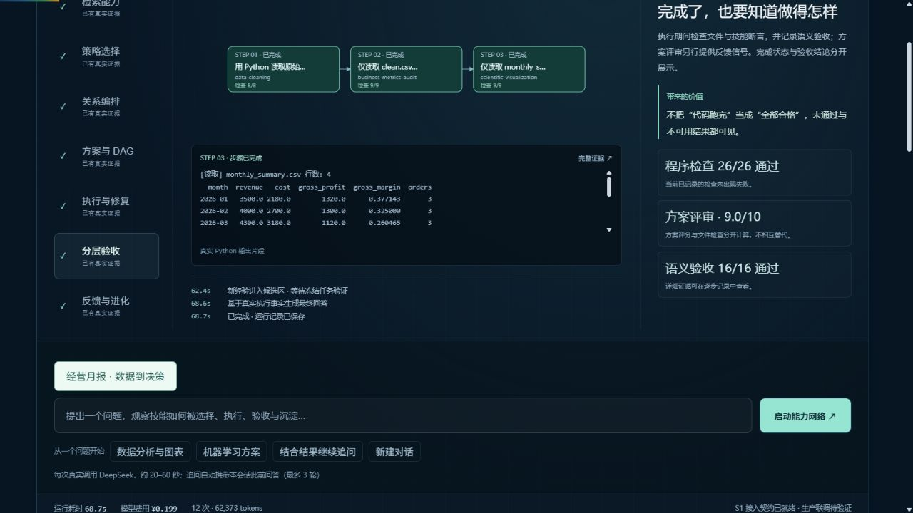
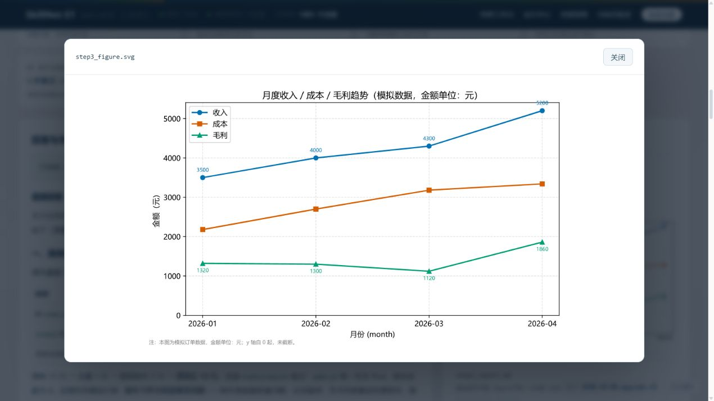
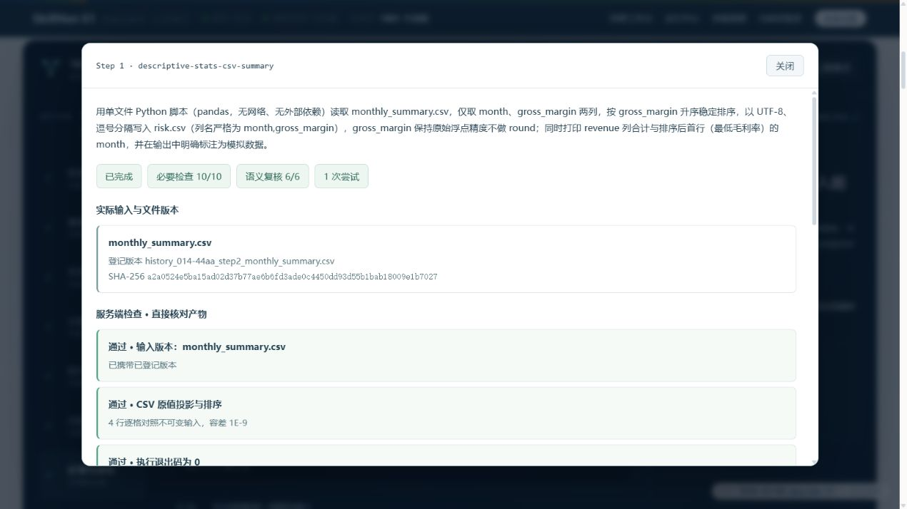

# 千级技能与执行证据升级 · 2026-10-08

本轮落实 A1–A10、B3–B10、C1–C10 的实现；保留原有入口、流体背景、可交互星图、七阶段完整演示、同题对照及历史回放。验收状态见 [逐项清单](upgrade-acceptance.md)。未完成的外部联调与评测明确列在下方。

## 1,769 个独立社区 Skill

不是文件数量，也不是仓库数量。每个条目都有独立 SKILL.md，按去除 frontmatter 后的正文哈希去重；保留原始文件、包内资源、许可证及固定提交。当前总库为 1,881 = 76 个种子 + 1,769 个社区 Skill + 36 个原有演化 Skill。

| 来源仓库 | 收录数 | 仓库 Stars（2026-10-08 核查） |
|---|---:|---:|
| [K-Dense-AI/scientific-agent-skills](https://github.com/K-Dense-AI/scientific-agent-skills) | 157 | 47,959 |
| [alirezarezvani/claude-skills](https://github.com/alirezarezvani/claude-skills) | 376 | 27,835 |
| [sickn33/agentic-awesome-skills](https://github.com/sickn33/agentic-awesome-skills) | 1,236 | 47,347 |

Stars 属于来源仓库，不代表每条 Skill 的评级。导入状态为 `indexed-reference`，不表示已在本环境执行认证。未知或受限许可、明显不安全标记、重复正文等条目被排除；详细计数、提交和压缩包 SHA-256 在 [来源锁定文件](../config/skill_sources.json)。许可证见 [第三方声明](../THIRD_PARTY_NOTICES.md)。

目录直接进入技能检索和详情；编排及执行按需读取原始正文（受上下文预算限制并注明截断），导出保留配套资源。社区关系为推断的 `similar_to`，不会伪装成执行依赖。包内脚本视为参考资料，导入器不运行脚本，项目测试发现限定为 `tests/`。第三方资料中可能仍有外部服务或资源依赖，执行前应按原文核对。

可重建命令：

```bash
python tools/acquire_skill_sources.py
python tools/import_community_skills.py
```

导入使用首次获取时固定的提交与压缩包校验值。常规启动直接读取已经提交的目录，无需再次抓取 GitHub。

## 前端与内核呈现

六个页面共用深蓝与薄荷色的视觉系统；首页保留原始流体背景与可拖动星图。千级目录使用分页与来源筛选，名称和用途分别呈现；详情能核对仓库、提交、原始路径、许可和指纹。

星图概览将 57 个原始领域归并为 7 大类，放大或点击领域展开真实节点；支持领域、关系及本次任务子图。物理布局使用空间分桶，避免千级节点全量两两计算。DAG 节点展示完整动作并可聚焦契约、代码、修复差异与产物；执行页增加集中查看模式，手机保留流程、时间线、详情切换。

结果先展示交付文件与未通过项目，再解释检索、选择、编排、执行、验收、反馈和候选经验。检索分、历史收益、探索项与模型选择理由分开显示；历史记录缺失理由时明确说明，不补写。执行成功、验收通过和学习晋级分别计数。CSV 可预览，SVG 以安全图片上下文呈现，文件指纹和消费版本可核对。

## 后端改变

- 规划声明 `depends_on / input_files / output_files / verification`。调度按真实文件生产者建立依赖；相同 Skill 的连续动作不会被误当作并行根节点。必要验收失败阻断下游，预算截断保留依赖闭包，并列出未执行动作。
- 规划前观察用户明确提供的 CSV：实际行数、列、空值及完全重复行，不凭空设定清洗后行数。验收按步骤职责缩小范围，读取完整生成代码、不可变输入与实际产物事实；无法确认的语义要求记录为 `unknown`。原值投影与排序可声明 `csv_projection`，服务端逐格比较原始输入和实际输出，不能把两边都舍入后自证正确。验收失败与执行异常均可触发预算内修复，保存原因、每次代码和差异，再复验。
- 追问携带登记文件、逻辑名、来源 Run、版本及 SHA-256；不以聊天摘要替代文件。签名 API 与实际文件读写的回归覆盖版本传递、篡改和跨身份访问。
- 新经验进入候选区。晋级必须对应同一候选哈希、至少 2 个冻结任务及 4 组真实执行，不能回退且必须有正增益；晋级时重新核验物理产物与独立算术 oracle。没有测到提升就保持候选。
- SQLite 队列提供原子领取、租约、取消和检查点；独立 worker 与 API 可分别启动。API 重启不会误终止外部 worker 的任务；失去 worker 租约时标记中断，保留已完成证据，避免静默重复收费。当前限制为单主机、一个库写入 worker。
- S1 后端签名覆盖请求方法、路径、正文哈希、时间、nonce、租户、用户和项目；写请求重放被持久化 nonce 拦截。Run、文件、列表、追问和候选记录按同一签名身份隔离。服务令牌仍应只留在后端。

## 可核查的验证

本地 Windows / Python 3.12：228 项 pytest 通过；`verify.py` 31/31 通过；六页面共 17 段脚本及全部现有前端逻辑检查通过。回归测试不需要模型余额。GitHub Actions 另覆盖 Linux / Windows、Python 3.11 / 3.12，以及真实 Docker 执行。

真实经营对照使用相同的公开模拟订单、3 步计划、预算和独立数值检查，分别执行无技能、背景技能、契约技能。三组均完成且得分 1.0，成本分别为 ¥0.069214、¥0.075962、¥0.076194。**这道题没有区分出质量增益**，不能据此声称契约模式更优，也不能证明管理层报告洞察质量。

原始报告：[真实执行对照](../out/execution-benchmark-1791446421.json)。14 份公开运行及其产物共 68 个文件有 [指纹清单](evidence/scale-upgrade-files.json)，克隆后仍可回放和核对。

充值后的完整在线经营演示 `b5492bb7-20261008-174014-44aa` 实际完成 3 步：15 行模拟订单清洗为 12 行，产出清洗表、月度汇总、SVG 与报告。26/26 必要检查、16/16 语义要求通过；独立算术 oracle 23/23 通过。SDK 随后携带同一汇总文件的版本和 SHA-256，完成 `02f80093-20261008-175420-f527` 追问：毛利率原值与排序经服务端直接核对，10/10 必要检查、6/6 语义要求通过。两次实际费用合计 ¥0.2927。见 [业务及追问证据](../out/business-followup-evidence.json)。这些检查不评价管理建议的洞察质量。

本轮保留失败事实：最初规划把 15 行误数为 14 行；另一次追问把毛利率舍入后自证正确，模型误判通过。分别补上输入观察值和独立原值检查后重跑上述合格记录，没有修改旧记录的状态或产物。

候选 `simulated-order-data-pipeline` 经 2 道冻结任务 × 2 次重复，完成 4 组学习前后配对（8 次真实执行），实际费用 ¥0.622936。所有前后分数均为 1.0，平均差 0；物理产物、独立算术分数及候选内容指纹重新核验后，调用真实晋级门得到拒绝，库和候选状态均未改变。见 [配对报告](../out/execution-benchmark-1791453374.json)、[晋级决定](../out/learning-promotion-evidence.json)、[被测候选](evidence/candidates/simulated-order-data-pipeline.json)。这是已完成的负面评测，不是学习增益证明。CLI 评测的在途检查点使用单独目录，完成后才发布到运行中心，避免 API 重启误判其状态。

独立 API + worker 的真实任务测试通过：排队后重启 API、执行期间再次重启 API、队列取消无模型调用、签名用户不能查看或下载其他用户产物、终态 SSE 回放。任务实际成本 ¥0.0454，8/8 必要检查、3/3 语义要求通过。报告：[部署实测](../out/deployment-smoke.json)。这是本机接入契约实测，不是 S1 线上联调。

Docker 在 [Linux CI](https://github.com/qing1989620/skillnet-demo/actions/runs/37758639881) 中使用项目实际执行适配器通过实机验证：非 root UID 1001、零 capabilities、no-new-privileges、只读根目录、禁网、不传宿主凭据、768 MiB / 2 CPU / 64 PID 限制、连续两步真实文件传递及超时终止。见 [容器证据](../out/docker-smoke.json)。Linux worker 须使用拥有共享工作目录的非 root 账号；禁止通过放宽目录权限解决挂载写入。这不是渗透测试，也没有验证 Windows Docker。

语义检索采用固定提交的 multilingual-e5-small ONNX。8 条开发查询用于暴露并校准旧融合权重，另加 4 条冻结留出查询。稠密配置权重为 0.35 / 0.55 / 0.10，词法回退保留 0.70 / 0.20 / 0.10。12 条查询的 Hit@10：词法 50%、稠密与新混合均 100%；留出部分见 [原始报告](../out/chinese-retrieval-evaluation.json)。样本很小，人工相关标签不穷尽，不能外推为总体召回率。[旧权重结果](../out/chinese-retrieval-before-calibration.json) 一并保留。

## 启动与演示

```bash
python -m pip install -r requirements-semantic.txt
python tools/setup_semantic_model.py
python run.py --no-browser
```

模型文件约 136 MB，不提交进仓库；下载脚本固定 revision 并记录文件哈希。未安装模型时使用明确标记的词法回退。`SKILLNET_ENCODER=dense` 可要求缺失时直接失败；`SKILLNET_ENCODER=lexical` 显式选择词法模式。

首页默认「回放一次真实任务」展示本轮完整经营月报；可展开长问题、暂停、调速、定位阶段并预览真实文件。「沿用同一文件追问」展示原值检查与版本传递。原有三步科研回放、1 步内核记录和七阶段完整演示均保留。经营案例可在输入区选择；内核实验室展示配对评测与未晋级原因。

外部 worker 部署及签名示例见 [S1 接入文档](s1-integration.md)。`tools/deployment_smoke.py` 使用单独数据目录与 8849 端口，运行真实模型任务，单次预算 ¥0.60；它会清理自己启动的服务进程。

## 尚待外部条件完成

1. 缺少 S1 后端契约、测试账户及部署配置，线上接入仍为 `production_connection_verified=false`。公开首页可访问不等于 SSO、权限和业务附件链路已联调。
2. 配对评测已完成，但两道题的前后分数没有差异，候选继续隔离。仍没有“越用越好”的实证，不能将负面评测改写成有效学习。
3. Linux Docker 实测已通过；本机没有 Docker，Windows Docker 与公司部署环境仍须分别验收。宿主子进程模式仅适用于受控演示。





